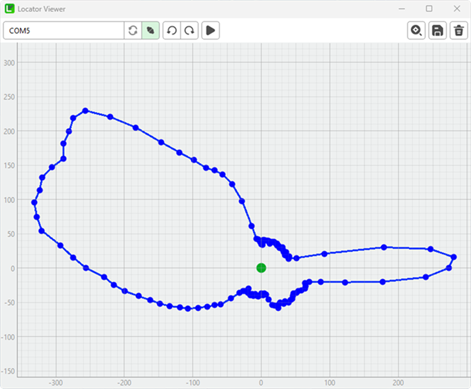

    </a>
    <h1>Locator Viewer</h1>

A graphical application for scanning and visualizing radar data using a connected serial device.

## Features

- **Serial Port Connection:** Connect to compatible radar devices via serial port
- **Real-time Scanning:** Perform scans and visualize data in real-time
- **Interactive Controls:**
    - Rotate radar left/right
    - Start/stop scanning
    - Clear and reset visualization
- **Data Export:** Save scan results as PNG images
- **Responsive UI:** Built with PyQt6 for smooth user experience

## Requirements

- Python 3.7+
- Required packages:
    - PyQt6
    - pyqtgraph
    - pyserial

## Installation

1. Download the latest release from releases
2. Run setup file
3. Follow the instructions on the screen to successfully installation

## Usage

1. **Connect to Device:**
    - Click "Update Ports" to refresh available serial ports
    - Select your device from the dropdown
    - Click "Connect" to establish connection

2. **Control:**
    - Use the rotate buttons to adjust device position
    - Click "Scan" to start a scanning procedure

3. **Visualization:**
    - View real-time scan results in the graph area
    - Use "Clear" to reset the visualization
    - Click "Export" to save the current scan as an image

## License

This project is open-source and available under the MIT License.

## Contributing

Contributions are welcome! Please open an issue or submit a pull request for any improvements or bug fixes.
